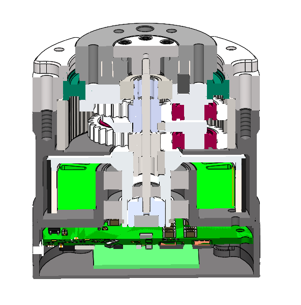

# 🏭 Nanjing Encos Motor Engineering  
### **Design & Structural Engineering Intern (2023–2024)**

---

## 🔧 Overview
At **Nanjing Encos**, I worked on the mechanical design and structural analysis of **custom brushless motors** and **planetary reducer gearboxes**.  
My work spanned CAD modeling, tolerance analysis, supplier coordination, and firmware-level tuning through VESC.

> **Goal:** Design compact, high-precision motor systems with optimized internal architecture, smooth mechanical integration, and reliable performance.

---

## 🖼️ Featured Work

---

## ⚙️ Engineering Highlights

### **Motor & Gearbox Design**
- Designed and assembled custom motors using **SolidWorks**
- Developed **5+ planetary reducer gearboxes** with different torque/speed ratios
- Created internal layouts for rotors, stators, magnets, and PCB assemblies
- Ran tolerance and fit analyses for compact, manufacturable designs

### **Manufacturing & Documentation**
- Produced detailed engineering drawings and GD&T for machined components
- Coordinated with suppliers to refine tolerances and assembly workflows
- Validated manufacturability with iterative assembly and teardown cycles

### **Performance Tuning**
- Calibrated and tuned motors using **VESC firmware**
- Performed load testing to measure torque, speed, thermal behavior, and efficiency
- Identified inefficiencies in gearbox backlash and improved through redesign

---

## 📈 Results & Impact

### **Engineering Outcomes**
- Delivered multiple motor prototypes used in internal electromechanical platforms  
- Reduced gearbox noise and backlash by optimizing tooth engagement & spacing  
- Improved torque transmission with refined gear geometry and internal support  
- Enhanced CAD and documentation standards for future company projects  

### **Team & Workflow Improvements**
- Accelerated supplier feedback loops by standardizing drawing formats  
- Increased assembly consistency with improved tolerance stack-up analyses  

---

## 💡 Key Lessons
- Small changes in internal spacing dramatically affect motor cooling and friction  
- Precise tolerances are critical for stable gearbox operation under load  
- Close collaboration with suppliers avoids unnecessary redesign cycles  
- Firmware tuning and mechanical tuning must be performed together for accuracy  
- Efficient teardown–rebuild cycles reveal hidden mechanical failure points  

---

## 👤 My Roles

### **Design Engineer**
- Modeled rotors, stators, housings, and complete motor assemblies  
- Designed multistage planetary reducers with high precision requirements  
- Created and revised technical drawings for CNC manufacturing  

### **Test & Validation Engineer**
- Tuned motors using VESC tools and configured operating parameters  
- Conducted load and thermal testing to verify performance  
- Diagnosed vibration, clearance, and alignment issues during operation  

---

[← Back to Home](/)
