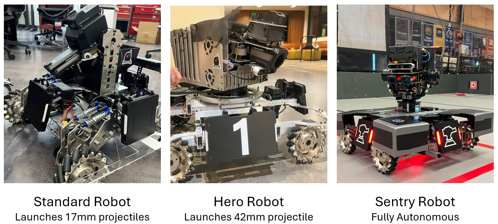

# 📌 NYU UltraViolet RoboMaster Team  
### **Mechanical Lead (2020–2021)** → **Team Captain (2021–2023)**

---

## 🚀 Overview
RoboMaster is an international engineering competition centered on **hands-on robot design**, rapid prototyping, and full electromechanical system integration.  
I contributed across four years—first as **Mechanical Lead**, then as **Team Captain** managing a **90+ member engineering team**.

> **Goal:** Build robust, high-performance mobile robots with precise motion, durable structures, and fast maintainability.

---

## 🖼️ Featured Robots

---

## 🔧 Engineering Highlights

### **Mechanical Design**
- CAD in **SolidWorks**, **Onshape**
- Structural FEA and weight optimization (Ansys)
- Designed drivetrain, chassis, suspension, and gimbal interfaces
- Created modular, interchangeable subsystems for rapid iteration

### **Prototyping & Fabrication**
- CNC machining, laser cutting, waterjet cutting, and 3D printing
- Produced manufacturing drawings, GD&T, and assembly documentation
- Implemented subsystem-level QA and fit checks

### **Team & Technical Leadership**
- Led **12-person mechanical team** (2020–2021)
- Captained the **full 90+ member team** (2021–2023)
- Organized design reviews, weekly build sprints, and integration testing
- Coordinated mechanical–electrical–software interfaces across all robots
- Managed season planning, budgeting, training, and competition logistics

---

## 🏆 Results & Impact

### **Competition Performance**
- **3rd Place — 2021 North America Regionals**
- **5th Place — 2022 & 2023 North America Regionals**

### **Engineering Outcomes**
- Increased drivetrain durability and motion stability  
- Reduced mechanical failure rates with new chassis & suspension designs  
- Improved maintainability and swap speed through modular redesign  
- Enhanced actuation precision and robot responsiveness

---

## 💡 Key Lessons
- Modular layouts significantly improve testing and serviceability  
- Strength–weight tradeoffs dictate long-term performance  
- Cross-team communication is essential for electromechanical systems  
- Iteration speed is more valuable than isolated subsystem optimization  
- Effective quick-fix strategies are critical during competition: identifying failure points fast, making temporary but reliable repairs, and prioritizing fixes that restore core functionality under time pressure

---

## 👤 My Roles

### **Mechanical Lead (2020–2021)**
- Designed and fabricated drivetrain, chassis, and gimbal components  
- Established CAD conventions, machining workflows, and documentation standards  
- Led subsystem integration and prototype validation  

### **Team Captain (2021–2023)**
- Directed ME/EE/CS teams and overall robot development  
- Oversaw multi-robot architecture, testing strategy, and design reviews  
- Managed 90+ members, onboarding, scheduling, and competition execution  
- Ensured cohesive integration across all mechanical and electrical subsystems

---

[← Back to Home](/)
