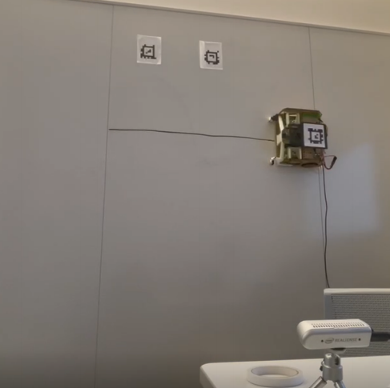

# 🧽 Whiteboard Erasing Robot (WIPER) — CMU  
### **Course Project · Fall 2024**

---

## 🧭 Overview
WIPER is a wall-mounted robot designed to autonomously follow trajectories and erase whiteboards.  
The project focused on implementing and comparing classical and optimal control methods while integrating vision-based localization.

> **Goal:** Evaluate the performance of different controllers for precise 2D trajectory tracking.

---

## 🚀 Engineering Highlights

### **Control Implementation**
- Implemented and compared **PID**, **TVLQR**, and **Model Predictive Control (MPC)**  
- Tuned controller parameters and evaluated tracking accuracy  
- Analyzed stability and robustness across multiple path shapes

### **Perception & Localization**
- Used **AprilTag pose estimation** for real-time 2D position feedback  
- Integrated camera measurements into the control loop  
- Ensured reliable tag detection under varying angles and distances

### **System Integration**
- Combined sensing, control, and actuation into a functional prototype  
- Established a full testing pipeline for trajectory execution  
- Verified performance through repeated trials on the wall-mounted test rig

---

## 🖼️ Project Image

---

## 💡 Key Lessons
- Controller performance is highly dependent on tuning and model fidelity  
- AprilTag localization is robust but sensitive to lighting and orientation  
- Simple mechanical systems still require strong sensing and software integration  

---

[← Back to Home](/)

