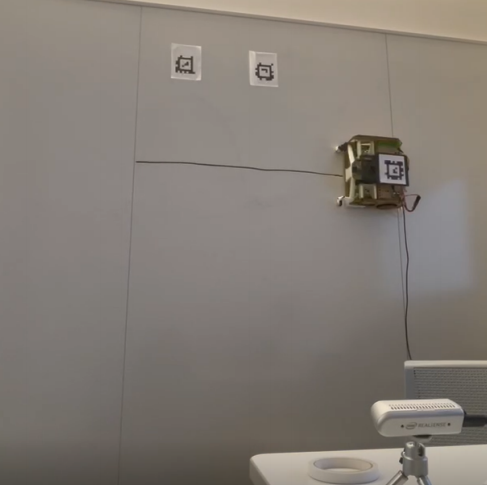

# 🧽 Whiteboard Erasing Robot (WIPER) — CMU  
### **Course Project · Fall 2024**

---

# 🧭 Introduction

Autonomous surface-cleaning robots have practical value in classrooms, offices, and industrial spaces by reducing repetitive manual labor and improving sanitation.  
WIPER is a wall-mounted robot designed to erase whiteboards by following precise 2D trajectories.

**Objective:** Implement and compare multiple control strategies—PID, TVLQR, and MPC—to evaluate their effectiveness in accurate trajectory tracking using real-time visual feedback.

---

# 🛠️ Design / Methods

## 🎯 Control Implementation
- Implemented **PID**, **Time-Varying LQR (TVLQR)**, and **Model Predictive Control (MPC)**  
- Tuned gains and horizon lengths through systematic testing  
- Evaluated controller behavior on straight lines, circles, and curved paths  
- Analyzed robustness to disturbances and parameter changes  

---

## 👁️ Perception & Localization
- Used **AprilTag pose estimation** for real-time 2D position feedback  
- Integrated camera measurements directly into the control loop  
- Conducted calibration to mitigate pose drift and ensure consistent detection  
- Verified detection reliability across lighting and viewing angles  

---

## 🔗 System Integration
- Combined vision, control, and actuation into a unified ROS-based pipeline  
- Developed a testing workflow for repeated trajectory execution  
- Validated performance on a wall-mounted test rig with controlled friction  
- Logged trial data for cross-controller comparison  

---

# 🖼️ Project Image

---

# 📈 Evaluation / Results

## 🔍 Controller Performance
- **PID:** Simple and responsive but showed steady-state error on curved paths  
- **TVLQR:** Smooth tracking with good stability, especially on dynamic paths  
- **MPC:** Achieved the **lowest average tracking error**, particularly on multi-turn trajectories  
- Overall, MPC provided the best accuracy, while TVLQR offered a strong balance of performance and computational cost  

---

## 📉 System-Level Observations
- AprilTag feedback worked reliably but became sensitive to glare and acute angles  
- Controller performance degraded when localization noise increased  
- Proper tuning dramatically improved stability and reduced overshoot  
- Mechanical simplicity required strong sensing and control compensation to maintain accuracy  

---

# 🧾 Conclusion

This project demonstrated the importance of integrating sensing, control, and software to achieve accurate trajectory tracking in autonomous robotic systems.  
By comparing PID, TVLQR, and MPC, we identified the trade-offs between simplicity, computational load, and tracking precision. The final results show that **MPC offers the most accurate and robust behavior** for this whiteboard-cleaning task.

The project strengthened my skills in **control theory**, **vision-based localization**, **system integration**, and **experimental evaluation**—all central to robotics engineering roles.

---

# 👤 My Role

- Implemented PID, TVLQR, and MPC controllers  
- Tuned parameters and evaluated performance across path sets  
- Integrated AprilTag localization with the control pipeline  
- Conducted experiments, logged data, and analyzed results  
- Prepared ROS-based workflow for repeated testing  

---

# 🧩 Skills Demonstrated
- Control systems (PID, LQR, MPC)  
- Computer vision & AprilTag pose estimation  
- System integration (sensing–control–actuation)  
- Experimental evaluation and data analysis  
- ROS-based development  

---

[← Back to Home](/)
